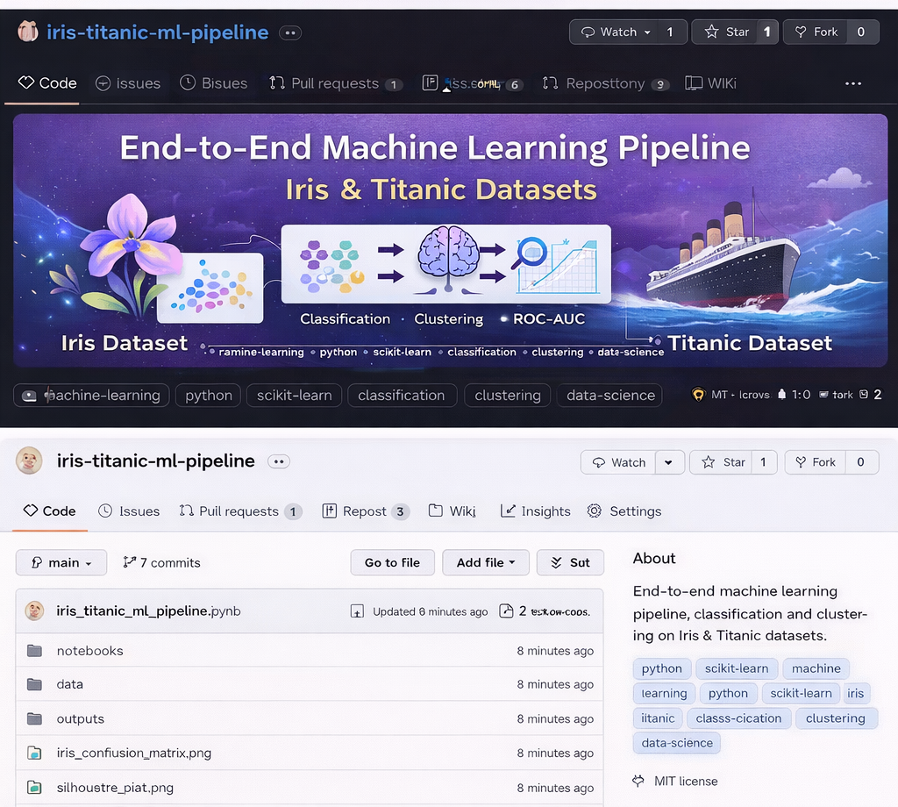

Machine Learning Assignment: Iris & Titanic
Overview

This project demonstrates supervised and unsupervised machine learning workflows using two classic datasets:

🌸 Iris Dataset (Multi-class classification + clustering)

🚢 Titanic Dataset (Binary classification)

The objective is to apply proper ML pipeline design, preprocessing, model evaluation, and comparison techniques.

Part A — Iris Dataset
Supervised Learning (KNN)

Train/Test Split (Stratified)

StandardScaler feature scaling

KNeighborsClassifier

n_neighbors = 7

Manhattan distance

Ball Tree algorithm

Results

Training Accuracy: 0.97

Test Accuracy: 0.94

Strong generalisation with minimal overfitting.

Unsupervised Learning (K-Means)

Tested k = 2 to 6

Silhouette score used for evaluation

Optimal clusters: k = 3

This matches the true number of Iris species.

Part B — Titanic Survival Prediction
Problem

Binary classification task predicting passenger survival.

Preprocessing

ColumnTransformer pipeline

Median imputation (numeric)

OneHotEncoding (categorical)

Stratified train-test split

Models Compared
Model	CV ROC-AUC	Test Accuracy
Logistic Regression	0.871 ± 0.021	0.80
Random Forest	0.880 ± 0.023	0.82
Key Findings

Random Forest slightly outperformed Logistic Regression.

Gender and passenger class are strong predictors.

Balanced pipeline prevents data leakage.

Technologies Used

Python

Scikit-learn

Pandas

NumPy

Matplotlib / Seaborn

Key Learning Outcomes

ML pipeline design

Feature scaling and encoding

Cross-validation

ROC-AUC evaluation

Overfitting detection

Model comparison

Author

Noor Saba
AI & ML with Python